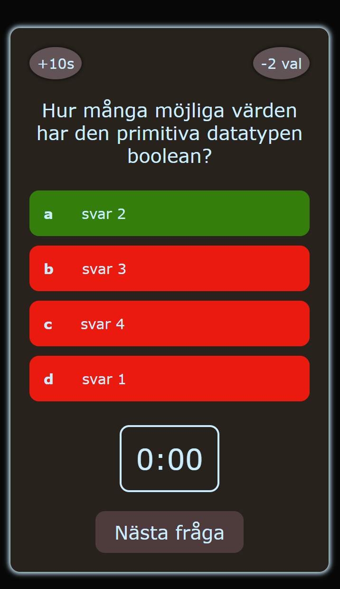

# quiz-game

A simple quiz game where you get 10 random questions selected from a pool of predefined questions. You get 15 seconds on every question, and you have the options to use two life lines during the game, but only once for each life line. After the user have selected an answer, the game will directly show you if it was the correct one or incorrect one. If you fail to answer withing the timelimit the question will be considered unanswered. In the end of the game you will see some statistics on how you did during the game. Number of correct answers, incorrect, fastest and so on. Down below is some screenshots.

